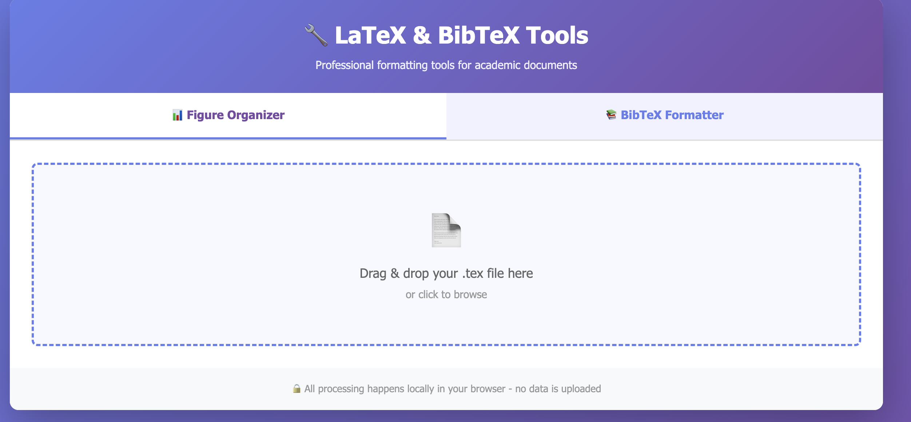

# LaTeX & BibTeX Tools

A free, open-source web toolkit with two powerful tools for formatting academic documents.

🔗 **[Try it now!](https://cnrs-oguzumut.github.io/bibtex-formatter/)**



## 🛠️ Two Tools in One

### 1. 📊 Figure Organizer
Automatically rename and organize your LaTeX figures into a clean, sequential structure.

### 2. 📚 BibTeX Formatter
Format BibTeX and BBL bibliography files with abbreviated author names and journal titles.

---

## 📊 Figure Organizer

### Features
- 🔢 **Sequential naming**: Renames figures to Fig1, Fig2-a, Fig2-b, etc.
- 📁 **Safe organization**: Creates `Figures_ordered/` folder, preserves originals
- 💬 **Comment-aware**: Ignores commented-out figures in LaTeX
- 📝 **Auto-updates paths**: Updates all `\includegraphics` references
- 🔧 **Bash script**: Generates script to copy files with new names

### How It Works

#### Before:
```latex
\begin{figure}
    \includegraphics{./Figures/old_image_v2_final.pdf}
\end{figure}
\begin{figure}
    \includegraphics{./Images/chart1.pdf}
    \includegraphics{./Images/chart2.pdf}
\end{figure}
```

#### After:
```latex
\begin{figure}
    \includegraphics{./Figures_ordered/Fig1.pdf}
\end{figure}
\begin{figure}
    \includegraphics{./Figures_ordered/Fig2-a.pdf}
    \includegraphics{./Figures_ordered/Fig2-b.pdf}
\end{figure}
```

### Quick Start
1. Open the **Figure Organizer** tab
2. Drag and drop your `.tex` file
3. Review the renaming preview
4. Download:
   - Updated `.tex` file with new paths
   - Bash script to organize the actual image files
5. Run the bash script in your project directory:
   ```bash
   bash organize_figures.sh
   ```

---

## 📚 BibTeX Formatter

### Features
- 📝 **Abbreviate author names**: "Jianqiao Hu" → "J. Hu"
- 📚 **Abbreviate journal names**: "Computational Materials Science" → "Comput. Mater. Sci."
- 🗑️ **Remove duplicates**: Automatically detects and removes duplicate entries
- 📊 **Real-time statistics**: See how many entries were processed
- 🔒 **100% Private**: All processing in your browser

### Supported Journals

The formatter includes abbreviations for 20+ common journals:
- Computational Materials Science → Comput. Mater. Sci.
- Acta Materialia → Acta Mater.
- International Journal of Plasticity → Int. J. Plast.
- Journal of the Mechanics and Physics of Solids → J. Mech. Phys. Solids
- And many more...

### How It Works

#### Before:
```bibtex
@article{example,
  author = {Jianqiao Hu and Zhuo Zhuang and Fengxian Liu},
  journal = {Computational Materials Science},
  ...
}
```

#### After:
```bibtex
@article{example,
  author = {J. Hu and Z. Zhuang and F. Liu},
  journal = {Comput. Mater. Sci.},
  ...
}
```

### Quick Start
1. Open the **BibTeX Formatter** tab
2. Drag and drop your `.bib` or `.bbl` file
3. Select formatting options:
   - ✅ Abbreviate author names
   - ✅ Abbreviate journal names
   - ✅ Remove duplicates
4. Click "Process File"
5. Your formatted file downloads automatically!

---

## 🚀 Installation & Usage

### Option 1: Use Online (Recommended)
Visit: https://cnrs-oguzumut.github.io/bibtex-formatter/

### Option 2: Download and Run Locally
1. Download `index.html` from this repository
2. Double-click to open in your browser
3. Both tools work offline - no internet required!

---

## 💻 Technical Details

### Figure Organizer
- Parses LaTeX `\begin{figure}...\end{figure}` environments
- Handles whitespace and tabs in `\includegraphics` commands
- Removes LaTeX comments before processing
- Supports multiple images per figure (auto-letters: a, b, c...)
- Generates bash script with dry-run mode and safety checks

### BibTeX Formatter
- Supports both `.bib` and `.bbl` formats
- Handles various author name formats (First Last, Last, First)
- Preserves LaTeX special characters and formatting
- Detects duplicates by content hash
- Extensible journal abbreviation dictionary

---

## 🎯 Use Cases

### Figure Organizer
- Preparing manuscripts for journal submission
- Organizing figures from multiple sources
- Cleaning up messy figure naming conventions
- Creating consistent figure numbering across documents

### BibTeX Formatter
- Standardizing bibliography format for journals
- Converting full names to abbreviated format
- Cleaning up bibliographies with duplicates
- Batch processing multiple bibliography files

---

## 🔧 Customization

### Adding Journal Abbreviations

Edit the `JOURNAL_ABBREV` dictionary in the HTML file:

```javascript
const JOURNAL_ABBREV = {
    'Your Journal Name': 'Abbrev.',
    'Another Journal': 'Another J.',
    // Add more here...
};
```

### Modifying Figure Naming

Change the naming scheme in the `processTexFile()` function:

```javascript
// Current: Fig1, Fig2-a, Fig2-b
const newName = `Fig${figureNumber}${ext}`;

// Example alternative: Figure_01, Figure_02a
const newName = `Figure_${figureNumber.toString().padStart(2, '0')}${ext}`;
```

---

## 🤝 Contributing

Contributions are welcome! Here's how you can help:

### Figure Organizer
- Support for subfigure environments
- Additional figure environments (wrapfigure, etc.)
- Custom naming schemes
- Preview mode before downloading

### BibTeX Formatter
- Add more journal abbreviations
- Support for more author name formats
- Additional file formats
- Custom abbreviation rules

### How to Contribute

1. Fork this repository
2. Create a feature branch (`git checkout -b feature/amazing-feature`)
3. Make your changes
4. Commit (`git commit -m 'Add amazing feature'`)
5. Push (`git push origin feature/amazing-feature`)
6. Open a Pull Request

---

## 📝 License

This project is licensed under the MIT License - see the [LICENSE](LICENSE) file for details.

---

## 🙏 Acknowledgments

Created to solve common formatting problems faced by researchers when preparing academic manuscripts.

---

## 📧 Support

- 🐛 **Found a bug?** [Open an issue](https://cnrs-oguzumut.github.io/bibtex-formatter/issues)
- 💡 **Have a feature request?** [Start a discussion](https://cnrs-oguzumut.github.io/bibtex-formatter/discussions)

---

## 📊 Statistics


---

⭐ **If you find these tools useful, please star this repository!**

---

## 🔄 Recent Updates

### Version 1.0.0
- ✨ Initial release with two tools
- 📊 Figure Organizer: Sequential renaming with folder organization
- 📚 BibTeX Formatter: Author and journal abbreviation
- 🔒 100% client-side processing for privacy
- 📱 Responsive design for mobile devices
